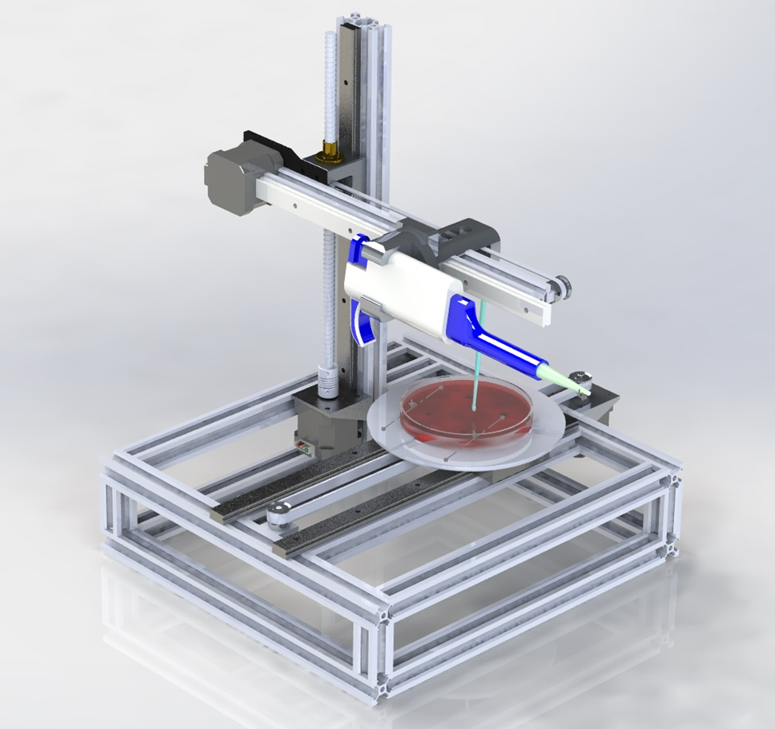

# Automatic-Bacteria-Streaking-Robot
This is a simple showcase of my thesis project where you can find some photos and videos about the building process and tests with real bacteria.

<h1>First conceptions</h1>

 ### [YouTube Demonstration](https://www.youtube.com/shorts/pXCyQN5C-c0)

<h2>Description</h2>
Project consists of a cartesian robot whose main goal is to draw the specific patterns utilized to streak bacteria samples in solid agar media culture, so it dispenses a small amount of bacteria sample with a micropippete and then uses the bacteriological loop to streak the whole plate with a certain pattern, right now, the device is capable of drawing four different kinds of patterns. It uses stepper motors nema 17 fot the motion, Arduino Mega as microcontroller with the firmware GRBL.
<br />


<h2>Languages and Utilities Used</h2>

- <b>C++</b> 
- <b>ESP32</b>
- <b>SolidWorks</b>
- <b>Fusion360</b>
- <b>3D printing</b>
- <b>GRBL</b>
- <b>Arduino Mega</b>


<h2>Device building process:</h2>

<p align="center">
CAD design: <br/>
</>
<br />
<br />
Select the disk:  <br/>

<br />
<br />
Enter the number of passes: <br/>

<br />
<br />
Confirm your selection:  <br/>

<br />
<br />
Wait for process to complete (may take some time):  <br/>

<br />
<br />
Sanitization complete:  <br/>

<br />
<br />
Observe the wiped disk:  <br/>

</p>

<!--
 ```diff
- text in red
+ text in green
! text in orange
# text in gray
@@ text in purple (and bold)@@
```
--!>
